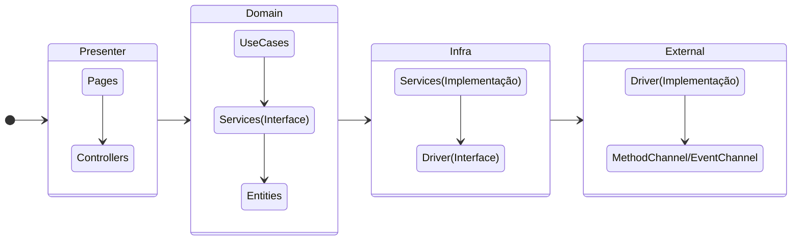

# Desafio Ziyou

Aplicativo desenvolvido em `Flutter` exclusivamente para o desafio da `ZiYou`.

O aplicativo consiste em um vídeo player onde é carregado um vídeo padrão e também podemos conectar esse vídeo em um Chrome Cast para isso é listando os dispositivos Chrome Cast na rede, após selecionar um, o vídeo irá ser carregado no dispositivo.
Há ainda a possibilidade de controlar o player, como dar play, pause e posição do vídeo através do aplicativo refletindo diretamente no dispositivo Chrome Cast. Também é possível desconectar um dispositivo.

<video width="320" height="240" controls>
  <source src="assets/video.mov" type="video/mp4">
</video>

## Plataformas

- Android
  - Versão mínima: 21
  - Versão target: 34
  - Versão da SDK de compilação: 34
- iOS
  - Versão mínima/target: 14

## Instruções

### Requisitos

Necessário ter no mínimo a versão do `Flutter` **3.24** configurado, `VSCode` instalado, `Android Studio` e `Xcode`.

### Rodar o projeto

Se você usa o `VSCode` ele já possui um `launch.json` configurado, tanto no modo `debug`, `profile` e `realease`, então para rodar o projeto, selecione qual deseja e apertar pressionar `F5` para executar o projeto(Caso não selecione nenhum, então o `debug` será iniciado)

> Necessário ter um dispositivo físico para testar a conexão com um chrome cast.

### Nativo 

Para trabalhar com o código nativo, no `Android Studio` abra o pasta `android` e no `Xcode` abra a pasta do `iOS`, ou no `VSCode` clique com o botão direito na pasta `iOS` e selecione `Abrir no Xcode`.

Não há nenhuma necessidade de configurar o `ChromeCast` toda a configuração já foi feita seguindo esses passos:

- Android
  - Adicionado `mediarouter` e `play-services-cast-framework` nas dependências;
  - Configurado `OptionsProvider` no `AndroidManifest`, o id foi passado o default `CC1AD845`.
- iOS
  - Adiciona a dependência `google-cast-sdk`;
  - Adiciona informações do `NSBonjourServices` onde é passado o id default e adiciona o `NSLocalNetworkUsageDescription` que explica o motivo do app de acessar a rede local no caso para localizar dispositivos Chrome Cast.

## Aplicativo

## Comunicação entre o Flutter e a plataforma host

Foi usado o `MethodChannel` e `EventChannel` para comunicação entre o Flutter e a plataforma nativa, o `MethodChannel` é usado para enviar mensagens para a plataforma nativa, nesse caso, por exemplo, a ação do **Play** invoca um método na plataforma nativa, já o `EventChannel` é usado para quando queremos ficar "ouvindo" no Flutter determinado eventos que acontecem na plataforma nativa, nesse caso foi usado para **descobrir dispositivos chrome cast** e para **ouvir eventos de sessão**.

> Na troca de informação é apenas possível passar dados simples, confira [aqui](https://docs.flutter.dev/platform-integration/platform-channels?gad_source=1&gclid=CjwKCAiA3Na5BhAZEiwAzrfagBDpt3Ah6gKvJ7l7wKv4cWtmmKYM6Ywz-yYS7w3lL0miPCVbkwvFlBoCpvMQAvD_BwE&gclsrc=aw.ds#codec) para saber mais.

A aplicação possui esses três:

O `MethodChannel` chamado `br.com.ziyou/player_chrome_cast` fica responsável por controlar ações do player, conectar e desconectar o dispositivo, possuindo os seguintes métodos:

- start_device -> Iniciar conexão com o Chrome Cast;
- set_media -> Setar uma mídia no ChromeCast;
- play -> Tocar o vídeo;
- pause -> Pausar o vídeo;
- seek -> Pular o vídeo para determinada posição
- disconnect_device -> Desconectar o dispositivo.

O `EventChannel` chamado `br.com.ziyou/chrome_cast_session` é responsável por informar o estado da sessão do dispositivo ele consume o listener da sessão do chrome cast.

O `EventChannel` chamado `br.com.ziyou/discovery_chrome_cast` é responsável por informar e atualizar os dispositivos que estão se conectando e desconectando da rede.

> Cada canal deve ter um nome único e no `MethodChannel` o método invocado é reconhecido através do nome passado para a plataforma nativa.

## Arquitetura

Esse projeto está usando `Arquitetura Limpa` e essas são as camadas.

Cada camada possui sua responsabilidade, abaixo uma explicação resumida:

- **Entidades**: Representação de dados para a aplicação e pode conter alguma regra de negócio;
- **UseCases**: Onde é aplicado as regras de negócio da aplicação
- **Services**: Atua como intermediário no acesso a algum hardware do dispositivo tratando os dados;
- **Drivers**: Acessa um hardware em específico, não há nenhum tratamento de dados há não ser o do próprio contrato.

A comunicação entre as camadas ocorre por meio de `interfaces`.

Tudo isso para deixamos o código mais **coeso** e **desacoplado**, se quisermos usamos outro serviço de streaming sem ser o `ChromeCast` basta fazer a implementação da interface do `driver`, podemos também trabalhar com mais de um `Streaming` dentro do nosso `Service`.

Na **gerência de estado** foi usado o próprio `ValueNotifier` do `Flutter`.

A injeção de dependência está sendo feito através do [GetIt](https://pub.dev/packages/get_it).

Foi priorizado testes de unidade nas camadas mais baixas, `domain, infra e external` que são consideradas importantes para o funcionamento da aplicação.

## Pontos de melhoria

- Separar a implementação nativa em um [plugin](https://docs.flutter.dev/packages-and-plugins/developing-packages#plugin) e assim utilizamos de forma desacoplada do projeto.
- Criar teste unitários na implementação nativa;
- Teste de unidade nos controllers e teste de widget.
- Ao invés de utilizar `MethodChannel` e `EventChannel`, utilizar [Pigeon](https://pub.dev/packages/pigeon) para comunicação entre o Flutter e a plataforma nativa diminuindo assim o código boilerplate e deixando a tipagem segura evitando erros de tempo de execução; 
- Implementar integração com o `Apple TV/AirPlay`;

## 📝 License

Copyright © 2024 [Kauê Martins](https://github.com/kmartins). 
This project is [MIT](https://opensource.org/licenses/MIT) licensed.